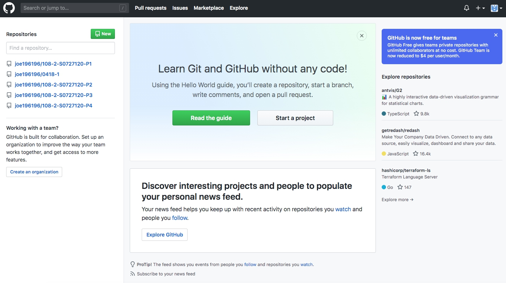

# 108-2-S0727120-P5
p5
<html>
<head>
<title>期末作業-5心得</title>
</head>
<body bgcolor="#CD8500">
<h1>網際網路期末心得</h1>

<h3>S0727120 劉冠廷</h3>

學習新的技能一項都覺得特別有趣， 
從高職開始一路都是走設計相關之事業及課業， 
從未接觸html的語法， 
才知道這真的有點難度， 
只要一堂課未到，下堂絕對聽不懂， 
朱老師相當用心，會為我們找適合的教材， 
也會適時的補充作業用得到的素材網址給我們做使用， 
感謝老師願意花時間教我們做網頁， 
雖然不知道以後會不會有機會再用到， 
但至少我們會有這項概念， 
有時間會想再專精，因為現在資訊化時代， 
網頁設計也是一項趨勢， 
希望也能將所學好好運用在往後的生活中。

</body>

</html>
